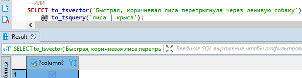

## Тип tsvector

Выполните запрос  
   
В ответ будет возвращен список лексем  
    

### Задание 1
Вызовите функцию to_tsvector для следующей строки: «Съешь ещё этих мягких французских булок, да выпей чаю»  
   
   
 Почему в векторе нет слова «да»?    
-Потому что «да» не является лексемой, т.е. данное слово не имеет ценности для различения слов. Данное слово является стоп-словом, однако оно влияет на длину вектора лексемы, в данном случае на длину ‘вып’:8  

## Тип tsquery
Выполните по очереди запросы  
  
  
  

### Задание 2
Что обозначают символы @@?  
@@ обозначает проверку на соответствие одной из лексем tsvector'a, указанной лексеме tsquery   
Почему второй запрос возвращает true, а третий не возвращает?    
-Потому что указанные в to_tsquery лексемы в первых двух случаях совпадют с лексемой из to_tsvector, а в третьем лексема foxhound не совпадает с лексемой fox из to_tsvector  
Выполните запрос  
  
  
Почему слово «булка» не находится?  
	Используйте функцию SELECT ts_lexize('russian_stem', 'булок'); для того чтобы понять почему.  
   
   
   
-Потому что мы пытаемся найти среди лексем tsvector лексему слова «булка», которой там нет. Для слова «булка» лексемой будет «булк»  
Замените в предложении слово «булок» на слово «пирожков»    
Выполните запросы  
  
  
Почему первый запрос возвращает true, а второй не возвращает?  
-Потому что в словаре лексем находится слово «Пирожк», соответственно в первом случае лексемы в tsvector и tsquery совпадают, а во втором случае лексема в tsvector не равняется лексеме в tsquery

## Операторы
Выполните запросы  
  
  
  
 
  

### Задание 3
Приведите аналогичные запросы для любого предложения на русском  
 
 
   
  
Почему для английского языка не нужно указывать язык в первом аргументе и какой анализатор используется если никакой не указан?    
-Потому что конфиге postgres по умолчанию указывается английский язык для поиска, поэтому можно не указывать. Если нужны другие языки, то нужно прописывать конкретный язык в запросе  

## Поиск фраз
Изучите документацию по операторам FTS. Выполните запрос  
 

### Задание 4
Что обозначает число 2 в операторе <->  
-Расстояние между указанным вектором 1 и вектором 2.То есть это число обозначает расстояние между указанными лексемами в векторном представлении  
Модифицируйте запрос так, чтобы можно было найти фразу «съешь ещё»  
  
Для чего можно использовать функцию phrase_tsquery?  
-Привести к типу данных tsquery для вычисления длины от одного вектора до другого 
  

## Утилиты
Приведите примеры использования функций ts_debug и ts_headline

*ts_debug*  
Можно удобно узнать информацию о каждом элементе, указанном в запросе. Например к какому языку принадлежит определенное слово, в случае, если в тексте одновременно используются слова разных языков  
   

*ts_headline*  
Выделяет указанную лексему. При работе с большим объемом информации можно удобно выделить полученное совпадение лексем  
    
  
